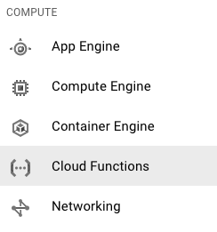

### Containerize and flatten your payment processing server into microservices using GCF.

`GCF-Stripe`is a serverless implementation of basic Stripe requests using Google Cloud Functions as containerized microservices. This repo is designed to help those just beginning with Google's Cloud Platform to get some basic services up and running on the Cloud Function product.

Check out the folders in the `master` branch where you'll find different requests ready to be dropped into your Google Cloud Functions - all packaged as `index.js` files, and ready to go.

### Getting Started

1.) Visit the [Google Cloud Functions](https://cloud.google.com/functions/) welcome page, and sign up for a free trial, or sign in to your Google Cloud account.

2.) Once logged in to your Cloud Platform Console, select the hamburger menu on the left, and enter the "Cloud Functions" management section.

3.) From here, you will create a new cloud function, ensuring to select `HTTP Trigger` as the Trigger option.

<h6>Deploying...</h6>

4.) Select `Inline Editor` under the Source code option, or upload your own version, using the code supplied in this repo.

5.) Ensure that you have replaced the pieces of code, where necessary, with your Stripe information - most importantly your [Stripe Keys](https://github.com/rldaulton/GCF-Stripe/blob/36f0bef34cfd0d37676208cdec7119c3bdca244a/Charge%20Customer/index.js#L4), which you can find in your Stripe Dashboard under `Dashboard > API`.

6.) Once deployed, use your client to call the endpoint for your function & supply the correct [parameters encoded](https://github.com/rldaulton/GCF-Stripe/blob/96fc38fc0220aee9a0ecaee718a8b0edf1db18d8/Charge%20Customer/index.js#L12) in the `URL` to interact with the Stripe API.

Happy serverless computing!

###Support
- For support and help getting your Google Cloud Functions up an running, take a look at their [Quickstart](https://cloud.google.com/functions/docs/quickstart) page.
- For help specifically with `HTTP Triggers` on your functions, check out the [HTTP Tutorial](https://cloud.google.com/functions/docs/tutorials/http).
- Be sure to check out the [writing HTTP cloud functions](https://cloud.google.com/functions/docs/writing/http) section for help and formatting, should you have any trouble.
- Looking for more serverless repos? Check out [awesome-serverless](https://github.com/anaibol/awesome-serverless).

For specific support regarding the Stripe functionality of the repo, see the respective sections below for Stripe's `Node JS` [API Docs](https://stripe.com/docs/api):

[<h5>Creating a Customer</h5>](https://stripe.com/docs/api/node#create_customer)

[<h5>Initiating a Charge</h5>](https://stripe.com/docs/api/node#create_charge)

[<h5>Subscribe Customer to Payment Plan</h5>](https://stripe.com/docs/api/node#create_subscription)

[<h5>UNsubscribe Customer from Payment Plan</h5>](https://stripe.com/docs/api/node#cancel_subscription)

[<h5>Adding a Source</h5>](https://stripe.com/docs/api/node#create_source)

[<h5>Delete a Source</h5>](https://stripe.com/docs/api/node#delete_card)

####Author
[@rldaulton](https://ryandaulton.com)
####License
MIT. See the [LICENSE](https://github.com/rldaulton/GCF-Stripe/blob/master/LICENSE) file for more information.
